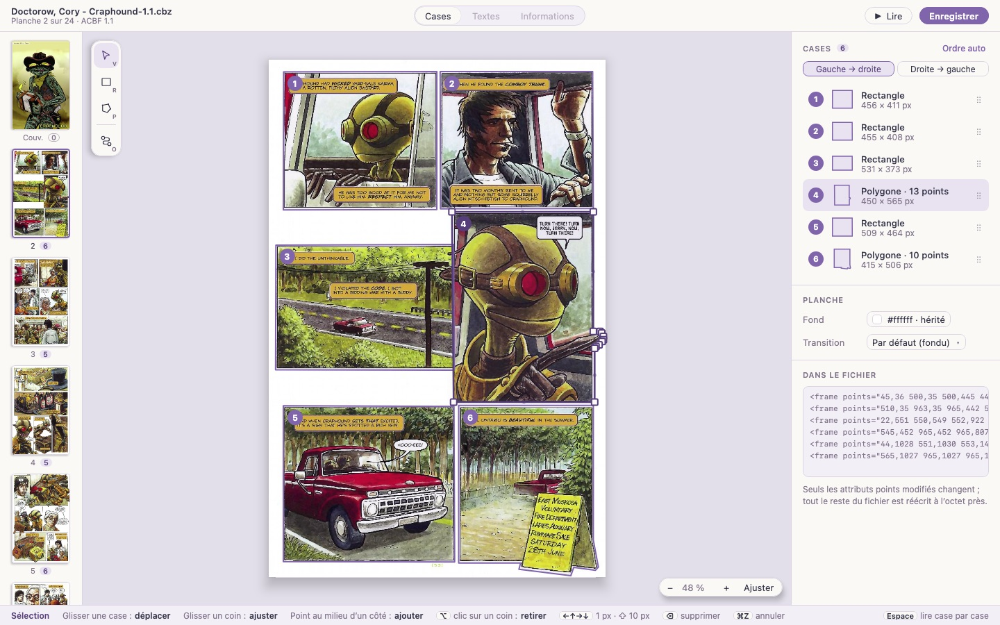
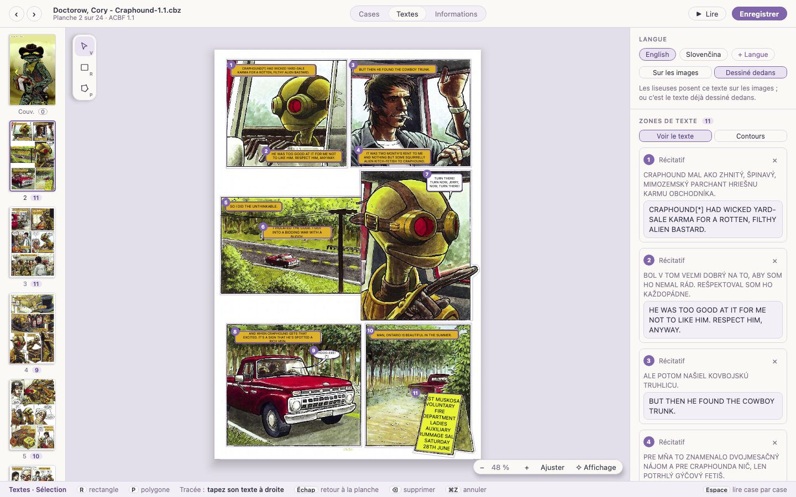
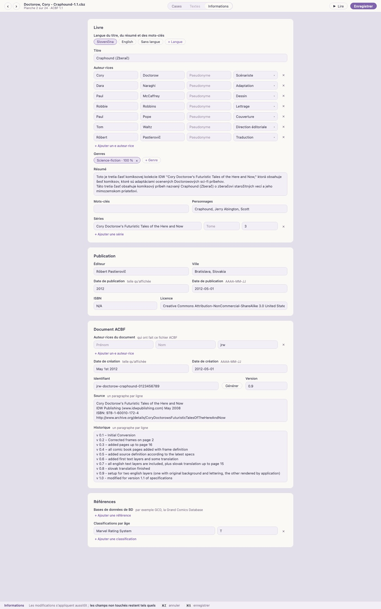

# Guide d’utilisation de Tessera

*[English version](GUIDE.md)*

Tessera édite les cases des bandes dessinées au format ACBF, pour que les liseuses puissent
les montrer case par case, en zoomant d’une case à la suivante. Il ouvre les archives CBZ,
avec ou sans document ACBF à l’intérieur, et les fichiers `.acbf` seuls.

## Ouvrir une bande dessinée

- **Fichier → Ouvrir…** (⌘O sur macOS, Ctrl+O ailleurs), ou déposez un fichier sur la fenêtre.
- Depuis un terminal : `./kotlin run -m app -- chemin/vers/livre.cbz`.

Formats pris en charge : archives `.cbz` et `.zip`, documents `.acbf` (images à côté, intégrées
au document en base64, ou dans des sous-dossiers). Un CBZ sans document ACBF s’ouvre aussi :
Tessera prend ses images dans l’ordre naturel (page2 avant page10), la première comme
couverture, et demande **À propos de cette bande dessinée** : titre (d’après le nom du fichier),
auteur·rices (prénom et nom, ou pseudonyme ; plusieurs séparés par des virgules), genre, langue
du livre, résumé facultatif, et votre nom comme auteur·rice du document ACBF (retenu). Les champs
vides ne sont pas écrits ; **Plus tard** ne garde que le titre. L’enregistrement ajoute le
document ACBF à l’archive ; il est valide selon le schéma officiel ACBF 1.1.

Les archives CBR (RAR) ne sont pas encore prises en charge.

### Importer un PDF

**Fichier → Importer un PDF…** (⌘I), ou un PDF déposé sur la fenêtre, le transforme en CBZ à
côté de lui (« Livre.cbz », ou « Livre (2).cbz » si le nom est pris ; **Changer…** choisit un
autre endroit), toujours à la meilleure qualité que contient le PDF et sans perte : une page qui
n’est qu’un JPEG (une BD numérisée) garde ce JPEG octet pour octet ; une page faite d’une autre
image garde ses pixels à leur résolution d’origine, en PNG ; une page avec du texte ou du dessin
vectoriel est rendue en PNG à 300 dpi, ou plus si ses images sont plus fines (jusqu’à 600). Une barre montre la progression, avec **Annuler**.
La bande dessinée s’ouvre ensuite avec **À propos de cette bande dessinée** prérempli d’après le
titre, l’auteur et le sujet du PDF.

## La fenêtre

| Zone | Contenu |
|---|---|
| Barre du haut | **‹ ›** planche précédente et suivante, nom du fichier (un point s’il y a des modifications non enregistrées ; un clic ouvre les informations du livre), numéro de planche et version ACBF, les onglets **Cases · Textes · Informations**, **Lire** et **Enregistrer** |
| Bandeau de gauche | Toutes les planches avec leur nombre de cases (de zones de texte dans **Textes**) ; un **0** en pointillé signale une planche qui n’en a pas |
| Canevas | La planche et ses cases, numérotées dans l’ordre de lecture ; les outils à gauche, le zoom en bas à droite |
| Inspecteur | La liste des cases, les réglages de la planche, ses cases telles qu’elles sont écrites dans le fichier, et le titre et les auteur·rices du livre |
| Barre d’aide | Ce que fait l’outil en cours, et ses touches |

La planche reste dans le canevas à tous les niveaux de zoom : elle ne recouvre jamais les
miniatures ni l’inspecteur.

Pendant le décodage d’une image, le canevas affiche **Chargement…** ; sur les gros livres, cela
peut prendre un instant par planche, et les planches voisines sont préparées à l’avance.

## Tracer des cases

| Outil | Touche | Comment |
|---|---|---|
| Sélection | V | Cliquez une case pour la sélectionner |
| Rectangle | R | Tracez un rectangle en glissant |
| Polygone | P | Cliquez chaque coin ; double-cliquez, recliquez le premier point, ou appuyez sur ↵, pour fermer. ⌫ retire le dernier point, Échap abandonne |
| Ordre de lecture | O | Cliquez les cases dans l’ordre où on les lit |

Les bords **s’aimantent** au bord de l’image et aux coins des autres cases : des cases voisines
s’alignent sans interstice. Une ligne rouge pointillée montre à quoi un bord s’est aimanté.
Après un tracé, Tessera revient à la sélection, la nouvelle case sélectionnée.

## Retoucher une case

Avec l’outil Sélection :

- **Déplacer** : glissez la case.
- **Ajuster un coin** : glissez l’une de ses poignées carrées.
- **Ajouter un coin** : glissez le petit point au milieu d’un côté.
- **Retirer un coin** : ⌥-clic dessus (Alt-clic sous Windows et Linux). Une case garde au moins
  trois coins.
- **Décaler** : les flèches déplacent la case sélectionnée de 1 pixel, de 10 avec ⇧.
- **Supprimer** : ⌫ ou Suppr.

Les cases peuvent se chevaucher. Un clic choisit la plus petite case sous le pointeur, si bien
qu’une case tracée à l’intérieur d’une autre reste accessible.

## Ordre de lecture

Les liseuses montrent les cases dans l’ordre du fichier. Trois façons de le régler :

- **Ordre auto** (inspecteur) : les lignes de haut en bas, et chaque ligne dans le sens choisi
  juste en dessous, **Gauche → droite** ou **Droite → gauche** (manga). Le sens part de
  l’élément `reading-direction` du livre quand il en a un.
- **Outil Ordre de lecture** (O) : cliquez les cases l’une après l’autre. Les cases non
  cliquées gardent leur ordre, après les autres. ↵ ou **Valider** l’applique ; Échap annule.
- **Glissez une ligne** de la liste des cases par sa poignée (⋮⋮).

## Lire case par case

**Lire** (ou Espace) montre la planche comme une liseuse : la vue glisse de case en case, et
tout ce qui sort de la case prend sa couleur de fond (celle de la case, sinon de la planche,
sinon du livre). Les flèches, Page préc./suiv. ou un clic passent d’une case à l’autre (un clic
dans le tiers gauche revient en arrière). Après la dernière case d’une planche vient la première
de la suivante, en fondu ; une planche sans case s’affiche en entier. Échap ou Espace ferme, et
l’éditeur se place sur la planche atteinte.

**Texte :** dans la barre choisit le calque de texte posé sur les images, dessiné comme dans
l’onglet Textes et découpé avec la case, ou **Tel que dessiné** pour les images seules ; **L**
passe d’une langue à l’autre. Lire depuis l’onglet Textes commence dans sa langue ; le choix est
gardé jusqu’à la fermeture de la bande dessinée.

La découpe suit la case en douceur : ses coins restent nets, les points tracés autour d’une
bulle deviennent une courbe ronde, et là où une bulle rejoint le bord de la case, l’angle est
légèrement arrondi. C’est seulement à l’écran ; le fichier garde ses points. Dans l’éditeur, un
fin pointillé montre cette découpe autour de chaque case qui n’est pas un simple rectangle.

## Affichage amélioré

Les numérisations en basse résolution paraissent floues ou pixellisées une fois agrandies,
surtout en lecture case par case. **✧ Affichage** au bout de la pastille de zoom (éditeur) et **✧ Affichage
amélioré** dans la barre de lecture ouvrent les réglages d’affichage, retenus séparément pour
l’édition et pour la lecture :

- **Désactivé** : les planches telles quelles.
- **Netteté** : des traits plus nets sans halo (la netteté adaptative d’AMD), instantané.
- **Restauration** : Anime4K, des réseaux de neurones entraînés sur le dessin au trait, efface
  les blocs de compression et redessine des traits propres en double résolution. Environ une
  seconde par planche, calculée en arrière-plan (la planche ordinaire s’affiche en attendant,
  puis est remplacée) ; en lecture, la planche suivante est préparée à l’avance.
- **Super-résolution** : Real-ESRGAN, un réseau plus grand, donne de loin le meilleur
  résultat, surtout sur les numérisations et PDF en basse résolution : traits propres et
  continus, plus de blocs de compression. Il est lent : environ deux minutes par planche la
  première fois sur un portable (une pastille sur la planche montre la progression ; vous pouvez
  continuer à lire). Chaque résultat est gardé à côté du livre, dans un dossier au nom du livre
  suivi de `.tessera` (par exemple `Livre.cbz.tessera`), et s’affiche aussitôt ensuite, même lors
  des sessions suivantes. En lecture, la planche suivante est calculée à l’avance.

Les planches déjà en haute définition (au-delà d’environ 4 mégapixels, comme les numérisations
à 300 dpi) ne sont pas agrandies en entier : cela prendrait de longues minutes pour peu de chose.
En lecture case par case, la restauration et la super-résolution améliorent plutôt la case que
vous lisez (environ une minute par case en super-résolution, gardée elle aussi à côté du livre).
Pendant la lecture, les 15 cases suivantes sont préparées dans l’ordre de lecture, d’une planche à
l’autre (une planche en définition plus basse en entier) ; la barre de lecture compte celles qui
sont prêtes. La case affichée passe toujours en premier. Les cases faites restent améliorées, et
celles calculées auparavant s’affichent aussitôt quand vous revenez sur une planche.

Cette préparation continue après la fermeture de la lecture. **Affichage → Préparer tout le
livre** (ou **Préparer tout le livre** dans le panneau d’affichage, en super-résolution) calcule
toutes les cases en arrière-plan : des heures pour un gros livre, après quoi la lecture est
instantanée partout. La barre du haut montre ce qui est en préparation (« ✦ Préparation du livre :
12 / 152 cases · 40 % ») ; son × l’arrête. Ouvrir une autre bande dessinée n’arrête pas la
préparation d’un livre entier : elle continue en arrière-plan (la barre du haut nomme ce livre,
avec son propre ×), derrière tout ce qui s’affiche dans la bande dessinée sur laquelle vous
travaillez ; rouvrir le livre la reprend là où elle en est.

**Netteté** et, pour la restauration et la super-résolution, **Force** règlent l’effet de 0
à 100 % ; une fois une planche calculée, les changer est instantané. Pour comparer,
maintenez **◐ Comparer** (à côté du bouton d’affichage, dans l’éditeur et dans la barre de
lecture) ou maintenez **C** : la planche s’affiche sans amélioration jusqu’à ce que vous lâchiez. L’étoile devient
pleine (✦) quand une amélioration est active. Seul l’affichage change : les fichiers ne sont
jamais modifiés, et les cases sont toujours tracées sur les vrais pixels de la planche. Pour un
travail au pixel près sur les cases, laissez l’éditeur sur Désactivé.

## Réglages de la planche

- **Fond** montre la couleur utilisée par les liseuses autour d’une case zoomée, et indique si
  elle est propre à la planche ou héritée du livre.
- **Transition** est l’animation depuis la planche précédente : fondu, mélange, défilement vers
  la droite, vers le bas, ou aucune.

## Textes et traductions

**Textes** (⌘2) montre les zones de texte de la planche dans une langue : bulles, récitatifs et
panneaux dont les liseuses posent le texte sur l’image, si bien qu’une bande dessinée se traduit
sans toucher à ses dessins.

- **Langue** : choisissez la langue en haut de l’inspecteur, ou ajoutez-en une avec **+ Langue**
  (elle est déclarée dans les informations du livre). **Sur les images** ou **Dessiné dedans**
  indique si les liseuses affichent ce texte, ou s’il s’agit du texte déjà dessiné dans les
  images (le `show` d’ACBF).
- **Tracer une zone** : comme pour les cases, **R** pour un rectangle autour d’une bulle, **P**
  pour un polygone point par point ; **V** sélectionne, déplace et ajuste. Le champ de texte de
  la nouvelle zone prend aussitôt le clavier : tapez le texte, un paragraphe par ligne, puis
  **Échap** pour revenir à la planche.
- **Traduire** : sur une planche qui a des zones dans une autre langue mais aucune dans
  celle-ci, **Copier les zones de …** copie leurs formes et réglages avec un texte vide ; chaque
  zone montre ensuite le texte de l’autre langue au-dessus de son champ.
- **Zone sélectionnée** : son genre (parole, récitatif, pensée, son, panneau…), **Texte clair
  sur fond sombre**, **Sans fond**, la rotation en degrés, et sa couleur de fond (`#rrggbb` ;
  vide : celle du calque).
- **Voir le texte** dessine chaque zone comme une liseuse ; **Contours** ne montre que les
  formes. Les cases restent visibles en filigrane.
- **Ajustement** : le texte prend la plus grande taille à laquelle il reste dans la forme même
  de la zone : chaque ligne est aussi large que la forme à sa hauteur, si bien qu’une bulle
  ronde a des lignes courtes en haut et en bas. Les mots sont coupés entre les syllabes avec un
  trait d’union, selon les règles de la langue du calque (motifs de TeX : anglais, français,
  allemand, espagnol, italien, néerlandais, portugais, slovaque, tchèque, polonais) ; le chinois
  et le japonais entre deux caractères. Un « ? », un « ! » ou un guillemet isolé reste avec son
  mot. Pareil en lecture.
- **◐ Couleur de l’image** (zone sélectionnée) donne au fond de la zone la couleur qu’il y a
  derrière le texte d’origine : les lettres sont écartées, le reste est moyenné (une trame donne
  son gris moyen). **Fonds pris dans l’image, toutes les zones** le fait pour toute la planche,
  en une seule étape d’annulation.

Supprimer la dernière zone d’une langue sur une planche retire le calque de cette planche, car
ACBF exige qu’un calque contienne au moins une zone. La saisie du texte d’une zone est une seule
étape d’annulation ; un paragraphe que vous ne touchez pas garde son italique. **Lire** depuis cet
onglet montre le livre dans la langue affichée ici.

## Informations du livre

**Informations** (⌘3) montre tous les champs de métadonnées du document. Elles sont aussi à un
clic de partout : le nom du fichier dans la barre du haut, ou **Modifier les informations** sous
le titre et les auteur·rices, en bas de l’inspecteur ; **Échap** ramène à l’onglet d’où vous
veniez. Quatre cartes :

- **Livre** : titre, auteur·rices (prénom, nom ou pseudonyme, et rôle : scénario, dessin,
  couleurs, traduction…), genres, résumé, mots-clés, personnages, séries (titre, tome, numéro).
  Le titre, le résumé et les mots-clés existent par langue : choisissez la langue dans les
  pastilles du haut, ou ajoutez-en une avec **+ Langue**.
- **Publication** : éditeur, ville, date de publication, ISBN, licence.
- **Document ACBF** : qui a fait ce fichier ACBF, date de création, identifiant (**Générer** en
  crée un unique), version, source et historique (un paragraphe par ligne).
- **Références** : fiches de bases de données de BD (comme GCD, la Grand Comics Database) et
  classifications par âge.

Les dates ont deux champs : le texte montré aux lecteurs (« Printemps 1953 ») et la date lisible
par les programmes, sous la forme AAAA-MM-JJ. Les modifications s’appliquent pendant la saisie ;
⌘Z annule un champ entier à la fois. Comme pour les cases, seul ce que vous changez est réécrit ;
un champ vidé garde son élément (vide), si bien qu’une valeur retapée revient à sa place. Un
paragraphe du résumé que vous ne touchez pas garde son italique et ses liens. Le sens de lecture
n’apparaît que pour les documents qui utilisent déjà la proposition ACBF 1.2, car un fichier
ACBF 1.1 ne peut pas le contenir.

## Se déplacer

| Action | Touches |
|---|---|
| Planche suivante / précédente | **‹ ›** dans la barre du haut, une miniature, Page suiv. / Page préc., ⌥ et une flèche, ou une flèche seule quand aucune case n’est sélectionnée |
| Zoomer | La molette (autour du pointeur), ⌘+ / ⌘−, ou les boutons de zoom |
| Ajuster la planche | ⌘0 ou **Ajuster** |
| Faire défiler | Glisser là où il n’y a pas de case (outil Sélection), glisser avec le bouton droit ou du milieu, ⌘ et la molette, ou ⇧ et la molette pour l’horizontale |
| Cases / Textes / Informations | ⌘1 / ⌘2 / ⌘3 (aussi dans le menu **Affichage**) ; **Échap** quitte les informations |
| Annuler / rétablir | ⌘Z / ⇧⌘Z |
| Enregistrer | ⌘S |
| Enregistrer sous | ⇧⌘S |

Sous Windows et Linux, Ctrl remplace ⌘.

## Enregistrement et compatibilité

**Enregistrer** (⌘S) réécrit la bande dessinée sur place, par un fichier temporaire qui ne
remplace l’original qu’une fois complet. **Fichier → Enregistrer sous…** (⇧⌘S) écrit une copie
sous un autre nom et continue sur cette copie ; un CBZ peut aller n’importe où, mais un document
ACBF dont les images sont à côté doit rester dans leur dossier. Dans un CBZ, seul le document ACBF est réécrit ; images et
polices sont recopiées telles quelles, sans recompression.

Tessera garde tout ce qu’il ne modifie pas : autres métadonnées, calques de texte, styles,
commentaires, éléments inconnus, et l’indentation du fichier. Ce qui change, ce sont les
attributs `points` des cases retouchées, et les éléments de case ajoutés, déplacés ou
supprimés. Le panneau **Dans le fichier** montre les cases de la planche telles qu’elles seront
écrites, vos changements en couleur. Les coordonnées sont toujours écrites en pixels entiers
séparés par une seule espace, la forme que toutes les liseuses ACBF comprennent.

Tout annuler redonne le fichier d’origine à l’octet près. Si vous fermez la fenêtre ou ouvrez
une autre bande dessinée avec des modifications non enregistrées, Tessera propose de les
enregistrer.

## Langue

**Langue** dans la barre de menus passe aussitôt de l’anglais au français. Le choix est retenu ;
la première fois, Tessera suit la langue du système.
