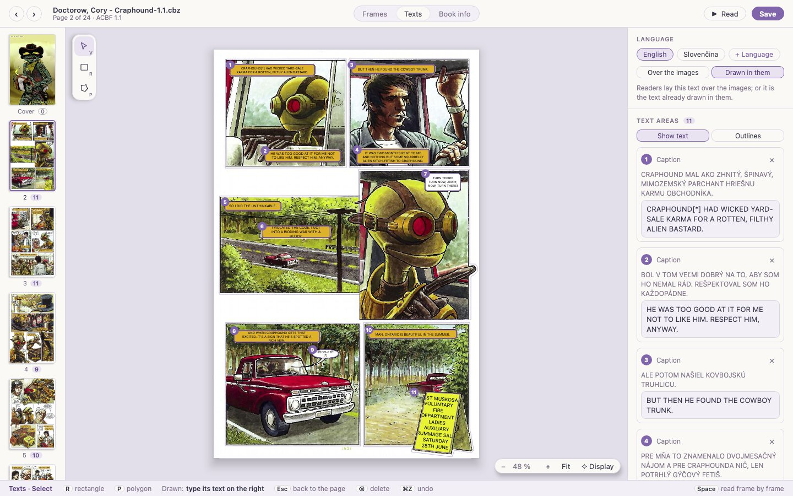

# Tessera user guide

*[Version française](GUIDE.fr.md)*

Tessera edits the frames of ACBF comics, so that readers can show a comic frame by frame,
zooming from one frame to the next. It opens CBZ archives, with or without an ACBF document
inside, and standalone `.acbf` files.

## Opening a comic

- **File → Open…** (⌘O on macOS, Ctrl+O elsewhere), or drop a file on the window.
- From a terminal: `./kotlin run -m app -- path/to/comic.cbz`.

Supported: `.cbz` and `.zip` archives, `.acbf` documents (images beside them, inside the
document in base64, or in sub-folders). A CBZ without an ACBF document is opened too: Tessera
lists its images in natural order (page2 before page10), the first one as the cover, and asks
**About this comic**: title (from the file name), authors (first and last name, or a pen name;
several separated by commas), genre, the book's language, an optional summary, and your name as
the maker of the ACBF document (remembered). Blank fields are left out of the file; **Later**
keeps just the title. Saving adds the ACBF document to the archive; it is valid against the
official ACBF 1.1 schema.

CBR (RAR) archives are not supported yet.

### Importing a PDF

**File → Import a PDF…** (⌘I), or drop a PDF on the window, turns it into a CBZ beside it
("Book.cbz", or "Book (2).cbz" when the name is taken; **Change…** picks another place), always
at the best quality the PDF holds and without loss: a page that is one JPEG (a scanned comic)
keeps that JPEG byte for byte; a page that is another kind of image keeps its pixels at their own
resolution, as PNG; a page with text or vector drawings is rendered as PNG at 300 dpi, or more if
its images are finer (up to 600). A bar shows the progress, with **Cancel**. The comic then opens with **About this
comic** filled in from the PDF's title, author and subject.

## The window

| Area | What it holds |
|---|---|
| Top bar | **‹ ›** previous and next page, file name (a dot when there are unsaved changes; click it for the book information), page number and ACBF version, the **Frames · Texts · Book info** tabs, **Read** and **Save** |
| Left strip | Every page with its number of frames (of text areas in **Texts**); a dashed **0** marks pages without any |
| Canvas | The page with its frames, numbered in reading order; the tools on the left, the zoom at the bottom right |
| Inspector | The frame list, the page settings, the page's frames as they are written in the file, and the book's title and authors |
| Hint bar | What the current tool does, and its keys |

The page stays inside the canvas at every zoom: the thumbnails and the inspector are never
covered.

While a page image is being decoded, the canvas says **Loading…**; large books can take a moment
per page, and the next and previous pages are prepared in advance.

## Drawing frames

| Tool | Key | How |
|---|---|---|
| Select | V | Click a frame to select it |
| Rectangle | R | Drag out a rectangle |
| Polygon | P | Click each corner; double-click, click the first point again, or press ↵, to close. ⌫ removes the last point, Esc gives up |
| Reading order | O | Click the frames in the order they are read |

Edges **snap** to the image border and to the corners of the other frames, so neighbouring
frames line up without gaps. A red dashed line shows what an edge snapped to. After drawing,
Tessera goes back to Select with the new frame selected.

## Adjusting a frame

With the Select tool:

- **Move**: drag the frame.
- **Adjust a corner**: drag one of its square handles.
- **Add a corner**: drag the small dot in the middle of a side.
- **Remove a corner**: ⌥-click it (Alt-click on Windows and Linux). A frame keeps at least
  three corners.
- **Nudge**: arrow keys move the selected frame by 1 pixel, with ⇧ by 10.
- **Delete**: ⌫ or Delete.

Overlapping frames are allowed. A click picks the smallest frame under the pointer, so a frame
drawn inside another stays reachable.

## Reading order

Readers show frames in the order they appear in the file. Three ways to set it:

- **Auto order** (inspector): rows from top to bottom, and each row in the direction chosen
  just below, **Left → right** or **Right → left** (manga). The direction starts from the
  book's own `reading-direction` when it has one.
- **Reading order tool** (O): click the frames one after the other. Frames you did not click
  keep their order after the ones you did. ↵ or **Done** applies it; Esc cancels.
- **Drag a row** of the frame list by its grip (⋮⋮).

## Reading frame by frame

**Read** (or Space) shows the page as a reader app would: the view glides from frame to
frame, and everything outside the frame takes the frame's background colour (the frame's own,
else the page's, else the book's). Arrows, Page Up/Down or a click move between frames (a click
on the left third goes back). After a page's last frame comes the next page's first frame, with
a fade; a page without frames is shown whole. Esc or Space closes it, and the editor goes to the
page you reached.

**Text:** in the bar chooses the text layer laid over the images, drawn as in the Texts tab and
cut with the frame, or **As drawn** for the images alone; **L** goes through the languages.
Reading from the Texts tab starts with its language; the choice is kept until the comic is
closed.

The cut follows the frame softly: its corners stay sharp, points traced around a balloon become
a round curve, and where a balloon meets the frame's edge the corner is slightly rounded. This is
on screen only; the file keeps its points. In the editor, a fine dashed line shows this cut
around every frame that is not a plain rectangle.

## Enhanced display

Low-resolution scans look blurry or blocky once enlarged, especially when reading frame by
frame. **✧ Display** at the right end of the zoom pill (editor) and **✧ Enhanced display** in the reading bar open the
display settings, remembered separately for editing and reading:

- **Off**: pages as they are.
- **Sharpen**: crisper lines without halos (AMD's contrast-adaptive sharpening), instant.
- **Restore**: Anime4K, neural networks trained on line art, removes compression blocks and
  redraws clean lines at twice the resolution. About a second per page, computed in the
  background (the plain page shows meanwhile, then is replaced); while reading, the next page
  is prepared ahead.
- **Super-res**: Real-ESRGAN, a larger network, gives the best result by far, especially on
  low-resolution scans and PDFs: clean continuous lines, no compression blocks. It is slow:
  about two minutes per page the first time on a laptop (a pill on the page shows the
  progress; you can keep reading). Each result is kept beside the book, in a folder named like
  the book plus `.tessera` (for example `Book.cbz.tessera`), and shows at once afterwards, also
  in later sessions. While reading, the next page is computed ahead.

Pages already in high definition (above about 4 megapixels, such as 300 dpi scans) are not
enlarged as a whole: that would take many minutes for little. When reading frame by frame,
Restore and Super-res improve the frame you read instead (about a minute per frame with
Super-res, kept beside the book too). While you read, the next 15 frames are prepared in
reading order, across pages (a lower-definition page as a whole); the reading bar counts how
many are ready. The frame shown always goes first. Frames done stay enhanced, and frames
computed earlier show at once when you come back to a page.

This preparation goes on after you close the reader. **View → Prepare the Whole Book** (or
**Prepare the whole book** in the display panel, in Super-res) computes every frame in the
background: hours for a large book, after which reading is instant everywhere. The top bar
shows what is being prepared ("✦ Preparing the book: 12 / 152 frames · 40 %"); its × stops it.
Opening another comic does not stop a whole-book preparation: it goes on in the background
(the top bar names that book, with its own ×), behind anything shown in the comic you work on;
reopening the book picks it up where it is.

**Sharpness** and, for Restore and Super-res, **Strength** adjust the effect from 0 to
100 %; once a page is computed, changing them is instant. To compare,
hold **◐ Compare** (beside the display button, in the editor and in the reading bar) or hold
**C**: the page shows without enhancement until you let go. The star turns
solid (✦) when an enhancement is on. This changes only what you see: files are never touched,
and frames are always drawn on the page's real pixels. For frame work at the pixel, leave the
editor on Off.

## Page settings

- **Background** shows the colour readers use around a zoomed frame, and whether it is the
  page's own or inherited from the book.
- **Transition** is the animation from the previous page: fade, blend, scroll right, scroll
  down, or none.

## Texts and translations

**Texts** (⌘2) shows the page's text areas in one language: the balloons, captions and signs
whose text readers lay over the image, so that a comic can be translated without touching its
pictures.

- **Language**: pick the language at the top of the inspector, or add one with **+ Language**
  (it is declared in the book's information). **Over the images** or **Drawn in them** says
  whether readers show this text, or whether it is the text already drawn in the pictures
  (ACBF's `show`).
- **Drawing an area**: as with frames, **R** for a rectangle around a balloon, **P** for a
  polygon point by point; **V** selects, moves and adjusts. The new area's text field takes the
  keyboard at once: type the text, one paragraph per line, then **Esc** to go back to the page.
- **Translating**: on a page that has areas in another language but none in this one, **Copy
  the areas of …** copies their shapes and settings with an empty text; each area then shows the
  other language's text above its field.
- **Selected area**: its kind (speech, caption, thought, sound, sign…), **Light text on dark**,
  **No ground**, rotation in degrees, and its own ground colour (`#rrggbb`; empty: the layer's).
- **Show text** draws each area as a reader would; **Outlines** shows the shapes only. The
  frames stay faintly visible beneath.
- **Fitting**: the text takes the largest size at which it stays inside the area's own shape:
  each line is as wide as the shape is at its height, so a round balloon gets short lines at
  the top and bottom. Words are cut between syllables with a hyphen, by the rules of the
  layer's language (TeX's patterns: English, French, German, Spanish, Italian, Dutch,
  Portuguese, Slovak, Czech, Polish); Chinese and Japanese between characters. A lone « ? »,
  « ! » or quotation mark stays with its word. Same in reading.
- **◐ Colour from the image** (selected area) makes the area's ground the colour behind the
  original text: the letters are left out, the rest averaged (a screentone gives its average
  grey). **Grounds from the image, every area** does it for the whole page in one undo step.

Deleting the last area of a language on a page removes that page's layer, as ACBF requires a
layer to hold at least one area. Typing an area's text is one undo step; a paragraph you do not
touch keeps its emphasis. **Read** from this tab shows the book with the language shown here.

## Book information

**Book info** (⌘3) shows every metadata field of the document. It is also one click away from
anywhere: the file name in the top bar, or **Edit book info** under the book's title and
authors at the bottom of the inspector; **Esc** goes back to the tab you came from. Four cards:

- **Book**: title, authors (first name, last name or pen name, and role: writer, artist,
  colourist, translator…), genres, summary, keywords, characters, series (title, volume,
  number). Title, summary and keywords exist per language: pick the language in the chips at
  the top, or add one with **+ Language**.
- **Publishing**: publisher, city, publication date, ISBN, licence.
- **ACBF document**: who made this ACBF file, creation date, identifier (**Generate** makes a
  unique one), version, source and history (one paragraph per line).
- **References**: comic database entries (such as GCD, the Grand Comics Database) and content
  ratings.

Dates have two fields: the text shown to readers ("Spring 1953") and the machine-readable date
as YYYY-MM-DD. Changes apply as you type; ⌘Z undoes a whole field at a time. As with frames,
only what you change is rewritten; a field you empty keeps its (empty) element, so retyping a
value puts it back where it was. A summary paragraph you do not touch keeps its emphasis and
links. The reading direction appears only for documents that already use the ACBF 1.2
proposal, since ACBF 1.1 files may not contain it.

## Moving around

| Action | Keys |
|---|---|
| Next / previous page | **‹ ›** in the top bar, a thumbnail, Page Down / Page Up, ⌥ and an arrow, or an arrow alone when no frame is selected |
| Zoom | The mouse wheel (around the pointer), ⌘+ / ⌘−, or the zoom buttons |
| Fit the page | ⌘0 or **Fit** |
| Scroll | Drag where there is no frame (Select tool), drag with the right or middle button, ⌘ and the wheel, or ⇧ and the wheel sideways |
| Frames / Texts / Book info | ⌘1 / ⌘2 / ⌘3 (also in the **View** menu); **Esc** leaves Book info |
| Undo / redo | ⌘Z / ⇧⌘Z |
| Save | ⌘S |
| Save as | ⇧⌘S |

On Windows and Linux, Ctrl replaces ⌘.

## Saving and compatibility

**Save** (⌘S) writes the comic back in place, through a temporary file that replaces the original
only once complete. **File → Save As…** (⇧⌘S) writes a copy under another name and goes on
editing the copy; a CBZ can go anywhere, while an ACBF document whose images lie beside it must
stay in their folder. Inside a CBZ, only the ACBF document is rewritten; images and fonts are copied
as they are, without recompression.

Tessera keeps everything it does not edit: other metadata, text layers, styles, comments,
unknown elements, and the file's own indentation. What changes are the `points` attributes of
the frames you touched, and the frame elements you added, moved or removed. The **In the file**
panel shows the page's frames as they will be written, with your changes highlighted. Points
are always written as whole pixels separated by single spaces, the form every ACBF reader
understands.

Undoing everything gives back the original file byte for byte. When you close the window or
open another comic with unsaved changes, Tessera asks whether to save them.

## Language

**Language** in the menu bar switches between English and French at once. The choice is
remembered; the first time, Tessera follows the system's language.
